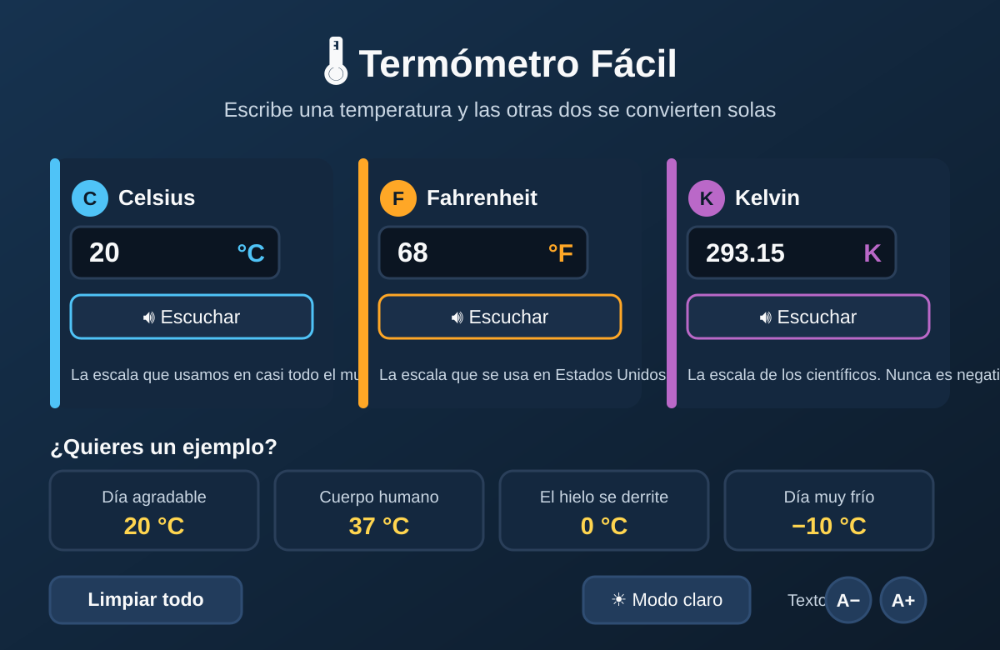

# 🌡️ Termómetro Fácil

**Convierte temperaturas entre Celsius, Fahrenheit y Kelvin al instante.**

Aplicación web de una sola página (HTML + CSS + JavaScript), pensada para que
cualquier persona — **especialmente personas mayores** — la use sin esfuerzo:
letra grande, alto contraste y cero complicaciones.

> Sin instalación · Sin dependencias · Funciona en cualquier navegador moderno


*Vista previa esquemática de la interfaz. Para incluir una captura real: abre
`index.html`, haz una captura de pantalla, guárdala como `captura.png` y cambia
el enlace de arriba por `captura.png`.*

---

## ✨ Características

- [x] 🔄 **Conversión en vivo**: escribe en un campo y los otros dos se actualizan solos
- [x] 🌡️ Las 3 escalas: **Celsius (C)**, **Fahrenheit (F)** y **Kelvin (K)**
- [x] 👍 **Ejemplos rápidos**: "Cuerpo humano 37 °C", "Día agradable 20 °C"…
- [x] 🔠 **A− / A+**: ajusta el tamaño del texto (se recuerda entre visitas)
- [x] 🎙️ **Botón de voz**: lee el resultado en voz alta, despacio y claro
- [x] ☀️ **Modo claro / oscuro**: cada persona elige cómo le luce mejor
- [x] 🚫 **Validaciones claras**: avisa con mensajes grandes si algo no es válido
- [x] ♿ **Accesible**: teclado completo, lectores de pantalla y `aria-live`
- [x] 📱 **Responsive**: se ve bien en móvil, tablet y ordenador

---

## 🚀 Cómo usarla

1. Descarga el proyecto (o clona el repositorio).
2. Haz **doble clic en `index.html`** — se abre en tu navegador.
3. Escribe una temperatura en cualquier campo y listo. ✨

> No hace falta servidor, ni instalar nada, ni conexión a internet.

---

## 🧠 Cómo funciona (esquema)

```
┌─────────────┐    ┌──────────┐    ┌───────────┐    ┌────────────┐
│  Escribes   │──▶│  Se lee  │──▶│  Fórmula  │──▶│  Se rellena │
│  en un campo │    │ el número │    │ de conversión│    │  el resto  │
└─────────────┘    └──────────┘    └───────────┘    └────────────┘
```

| Paso | Qué pasa |
|---|---|
| 1. Escribes | P. ej. `20` en Celsius |
| 2. Se valida | Se aceptan decimales (`.` o `,`) y negativos |
| 3. Se convierte | Se calculan Fahrenheit y Kelvin con las fórmulas |
| 4. Se muestra | Resultados redondeados a 2 decimales |
| Si hay error | Aparece un mensaje grande y comprensible |

---

## 🌡️ Las tres escalas (para todos los públicos)

| Escala | ¿Dónde se usa? | El agua se congela | El agua hierve | Referencia cotidiana |
|---|---|---|---|---|
| **Celsius (°C)** | Casi todo el mundo | 0 °C | 100 °C | La temperatura del tiempo |
| **Fahrenheit (°F)** | Estados Unidos y algunos países | 32 °F | 212 °F | La temperatura del tiempo allí |
| **Kelvin (K)** | Ciencia y laboratorios | 273.15 K | 373.15 K | Nunca es negativa: 0 K es el frío absoluto |

> 💡 **Dato curioso**: 0 Kelvin (−273,15 °C) es la temperatura más baja posible
> en el universo. A esa temperatura, los átomos apenas se mueven.

---

## 🧮 Fórmulas de conversión

| Conversión | Fórmula |
|---|---|
| C → F | `F = C × 9/5 + 32` |
| C → K | `K = C + 273.15` |
| F → C | `C = (F − 32) × 5/9` |
| F → K | `K = (F − 32) × 5/9 + 273.15` |
| K → C | `C = K − 273.15` |
| K → F | `F = (K − 273.15) × 9/5 + 32` |

### Ejemplos de la vida real

| Situación | °C | °F | K |
|---|---|---|---|
| Día agradable | 20 | 68 | 293.15 |
| Cuerpo humano | 37 | 98.6 | 310.15 |
| El hielo se derrite | 0 | 32 | 273.15 |
| Día muy frío | −10 | 14 | 263.15 |
| Cero absoluto | −273.15 | −459.67 | 0 |

---

## ♿ Diseño pensado para personas mayores

| Decisión | Por qué |
|---|---|
| 🔠 Letra grande (20 px base, hasta 28 px) | Se lee sin esfuerzo ni gafas de cerca |
| 🎨 Alto contraste (texto claro sobre fondo oscuro) | Todo se distingue con claridad |
| 🖱️ Botones y campos grandes | Fáciles de ver y de tocar |
| 🧹 Un solo campo activo a la vez | Evita confusiones al escribir encima |
| 💬 Mensajes de error claros | Dicen exactamente qué hacer |
| 🌙 Sin animaciones bruscas | Respeta `prefers-reduced-motion` |
| 📢 Soporte para lectores de pantalla | `aria-label`, `role="alert"`, `aria-live` |
| 🔊 Botón "Escuchar" en cada escala | Lee el resultado en voz alta (Web Speech API) |
| ☀️ Modo claro y oscuro | Cada persona elige el contraste que mejor le va |

---

## 📁 Estructura del proyecto

```
├── index.html   → estructura y contenido de la página
├── style.css    → diseño, colores y accesibilidad visual
├── app.js       → lógica de conversión y validaciones
├── captura.svg  → vista previa de la interfaz (usada en el README)
├── LICENSE      → licencia MIT
└── README.md    → este archivo
```

---

## 🛠️ Tecnologías

- **HTML5** — estructura semántica y accesible
- **CSS3** — diseño con variables, `grid` y `rem` (todo crece con A+)
- **JavaScript (vanilla)** — cero dependencias, cero frameworks

---

## 🗺️ Ideas para el futuro

- [ ] 📜 Historial de conversiones recientes
- [ ] 🌍 Más idiomas (inglés, etc.)

---

## 📄 Licencia

Este proyecto se distribuye bajo la licencia **MIT** (ver [`LICENSE`](LICENSE)).